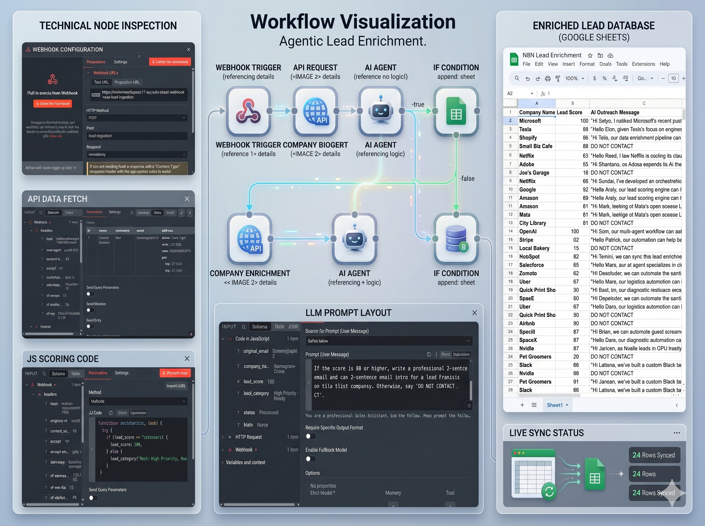

# 🚀 AI-Driven Lead Enrichment Pipeline (n8n + Gemini Pro)

A modular, event-driven automation system that transforms raw inbound lead data into qualified, high-priority sales opportunities using **Agentic AI** and custom algorithmic scoring logic.

---

## 📋 Features

* **Custom Scoring Engine:** JavaScript-based evaluation layer that dynamically computes lead quality scores based on company size, industry vertical, and acquisition source.
* **AI Decision Layer:** Integrates **Google Gemini Pro** to analyze prospect contextual data and generate tailored, 2-sentence cold outreach hooks.
* **Conditional Routing:** Smart IF branching that isolates low-priority leads (`Do Not Contact`) to preserve database hygiene and sender reputation.
* **Real-Time Database Sync:** Automatically appends enriched records with computed scores and AI drafts directly to Google Sheets for immediate sales action.

---

## 🛠️ Tech Stack

* **Workflow Orchestration:** `n8n (Self-Hosted / Cloud)`
* **LLM Engine:** `Google Gemini Pro API`
* **Custom Logic & Parsing:** `JavaScript (Node.js runtime)`
* **Database & CRM:** `Google Sheets API`
* **Ingestion Layer:** `Webhook / REST API`

---

## 📐 Pipeline Architecture

[Inbound Webhook Trigger] ➔ [JS Lead Scoring Engine] ➔ [Gemini Pro AI Node] ➔ [Conditional Filter Switch] ➔ [Google Sheets CRM Sync]

---

## 🚀 Getting Started

### Prerequisites
* An active **n8n** instance (Docker self-hosted or n8n Cloud).
* A **Google Gemini API Key**.
* A Google Cloud Console project with **Google Sheets API** enabled and OAuth2 credentials configured.

### Installation
1. **Import Blueprint:** Download the `workflow.json` file from this repository and import it into your n8n workspace.
2. **Configure Credentials:**
   * Add your Gemini API key inside the **Google Gemini / AI Agent** node.
   * Connect your Google account inside the **Google Sheets** node.
3. **Deploy Webhook:** Switch the Webhook node from *Test* to **Production** URL and toggle the workflow to **Active / Published** for 24/7 autonomous ingestion.

---

## 📄 License
This project is licensed under the [MIT License](LICENSE).
